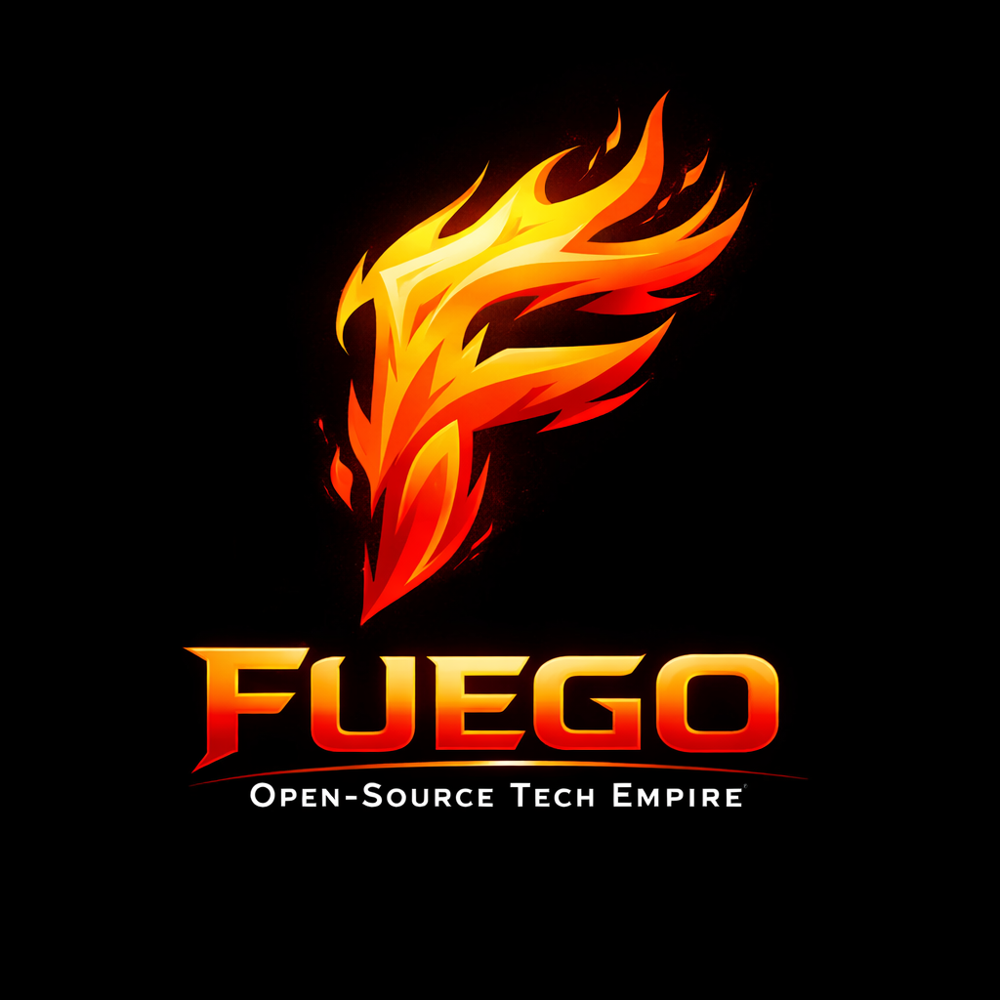

  

<h1 align="center">Fuego</h1>

<strong>Open-Source Tech Empire</strong>

---

## About

**About Fuego Technology:**

At Fuego, we are dedicated to creating an open-source tech empire.  
We believe in the power of open-source technology and **client-side HTML**.

Our goal is to build client-side technologies comparable to those of **Microsoft** and **Google**, but fully open, transparent, and community-driven.

---

## Projects We Hope to Do

We are a group of **2 people** pushing client-side technologies to their limits.  
Here are some projects we are working on:

1. **Fuego Mark** – Google Docs / Microsoft Word alternative  
2. **Fuego Present** – Google Slides / Microsoft PowerPoint alternative  
3. **Fuego Data** – Google Sheets / Microsoft Excel alternative  
4. **Client-side Web Browser** (experimental)  
5. **Fuego Cloud** – Free alternative to Azure, GCP, and AWS  
6. **Winedows** – Windows Docker image for Linux  
7. **FuegoOS** – Windows alternative built in HTML  
8. **JsGPU** – Graphics accelerator written in JavaScript

---

## Website

🚧 We plan to host a website soon.
